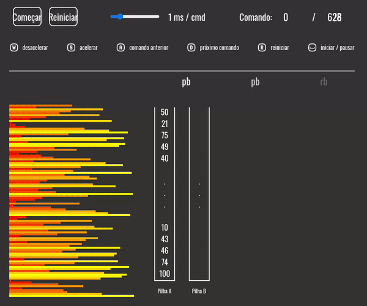

# PUSH_SWAP


## Descrição

O projeto **Push Swap** é um desafio de algoritmos que envolve a ordenação de um conjunto de inteiros utilizando duas pilhas (stacks) e um conjunto específico de instruções. O objetivo é desenvolver um programa em C chamado `push_swap` que calcula e exibe a sequência mais curta de instruções, na linguagem Push Swap, para ordenar os inteiros recebidos como argumentos.

## Objetivos

- Escrever um algoritmo de ordenação eficiente.
- Aprender sobre complexidade de algoritmos.
- Praticar a programação em C de acordo com as normas estabelecidas.
- Compreender e implementar operações em pilhas.

### Instruções Comuns

- O projeto deve ser escrito em C e seguir as normas (Norm).
- Deve evitar falhas inesperadas (ex: segmentation fault, bus error).
- Toda memória alocada deve ser liberada corretamente.
- Um Makefile deve ser incluído, que compile os arquivos de origem para o executável `push_swap`.

## Estrutura do Projeto

### Pilhas

- Você terá duas pilhas: `a` e `b`.
- A pilha `a` deve conter uma quantidade aleatória de números inteiros (negativos e/ou positivos) sem duplicatas.
- A pilha `b` deve começar vazia.

### Instruções

Você pode usar as seguintes instruções para manipular as pilhas:

- **sa**: Troca os dois primeiros elementos da pilha `a`.
- **sb**: Troca os dois primeiros elementos da pilha `b`.
- **ss**: Executa `sa` e `sb` ao mesmo tempo.
- **pa**: Move o primeiro elemento da pilha `b` para o topo da pilha `a`.
- **pb**: Move o primeiro elemento da pilha `a` para o topo da pilha `b`.
- **ra**: Rotaciona a pilha `a` para cima.
- **rb**: Rotaciona a pilha `b` para cima.
- **rr**: Executa `ra` e `rb` ao mesmo tempo.
- **rra**: Rotaciona a pilha `a` para baixo.
- **rrb**: Rotaciona a pilha `b` para baixo.
- **rrr**: Executa `rra` e `rrb` ao mesmo tempo.

### Exemplo de Uso

Para usar o programa, você deve passar uma lista de números inteiros como argumento. Por exemplo:

```bash
./push_swap 2 1 3 6 5 8
```

O programa exibirá a sequência de instruções necessárias para ordenar os números.

## Compilação

O projeto inclui um Makefile que permite compilar o programa facilmente. Para compilar, execute o seguinte comando:

```
make
```

Para limpar os arquivos de objeto gerados, use:

```
make clean
```

Para remover o executável e os arquivos de objeto, use:

```
make fclean
```

Para recompilar, execute:

```
make re
```

## Visualizador

Para facilitar a visualização do funcionamento do seu programa, um vídeo demonstrativo está disponível. Este vídeo mostra como o algoritmo ordena os números em tempo real, utilizando a estrutura de pilhas.



## Benchmark

Para validação do projeto, você deve ser capaz de ordenar 100 números aleatórios em menos de 700 operações. Para a validação máxima, você deve conseguir ordenar 500 números em menos de 5500 operações.

## Considerações Finais

Este projeto é uma excelente oportunidade para aprimorar suas habilidades em algoritmos e programação em C, além de ser um bom ponto de partida para entender conceitos de complexidade que podem ser úteis em entrevistas de emprego.

